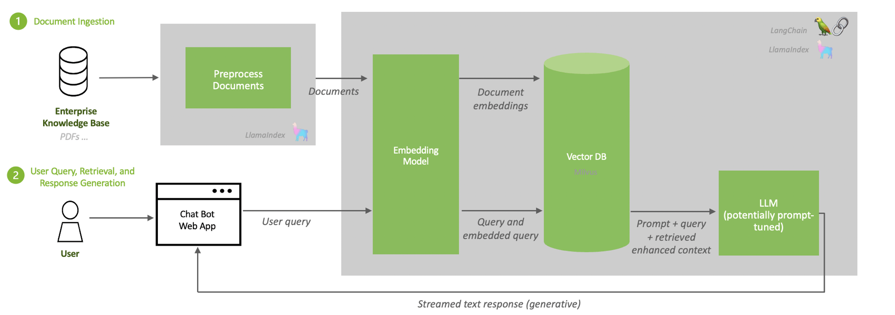

# Notes

## RAG Architecture

On a high level, the architecture of a RAG system can be distilled down to the pipelines shown in the figure above:

- A recurring pipeline of document pre-processing, ingestion and embedding generation.
- An inference pipeline with a user query and response generation.

Let us understand the first pipeline in detail.

### Document Ingestion:

First, raw data from diverse sources, such as databases, documents, or live feeds, is ingested into the RAG system. To pre-process this data, LangChain provides a variety of document loaders that load data of many forms from many different sources.

The term document loader is used loosely. Source documents do not necessarily need to be what you might think of as standard documents (PDFs, text files, and so on). For example, LangChain supports loading data from Confluence, CSV files, Outlook emails, and more. LlamaIndex also provides a variety of loaders, which can be viewed in LlamaHub.

### Document Pre-processing

After documents have been loaded, they are often transformed. One transformation is text-splitting, which breaks down long texts into smaller segments. This is necessary for fitting the texts into the embedding model, like e5-large-v2 which has a maximum token length of 512. While splitting the text sounds simple, this can be a nuanced process. Remember tokenizers!!

### Generate Embeddings

When data is ingested, it must be transformed into a format that the system can efficiently process. So we convert data into high-dimensional vectores, which represent text in a numerical format.

### Storing Embeddings in a Vector Database

The generated embeddings are now stored in vector dbs. These dbs enable rapid search and retrieval operations on vectors. Storing data in RAPIDS RAFT accelerated vector databases like Milvus guarantees that information remains accessible and can be quickly retrieved during real-time interactions.

The architecture of RAG consists of:

- Retriever: Often based on models like BM25, dpr(Dense Passage Retrieval), or other embedding based retrieval techniques
- Generator: Typically a tranformer based generative model such as BART or T5, fine-tuned to produce text conditioned on the retrieved documents.

### Training RAG

Training involves two main stages:

- Retriever Training: The retriever is trained to find relevant documents / data from the corpus
- Joint Training: The retriver and generator are fine-tuned together so that the retrieved documents help the generator produce better results.

### Key Challenges

- Computational Resources: The entire process requires significant computational power.
- Quality of Retrieval: Entire process heavily relies on the retrieval operation. Poor retrieval can lead to subpar generation.
- Scalability: Managing and searching through large corpus efficiently is a technical challenge.

RAG represents a significant step forward in making AI models more informative and context-aware by combining the strengths of retrieval and generative approaches.

## How does it work?

In a Retrieval-Augmented Generation (RAG) model, the generative model (such as GPT-3, BART, or T5) uses the input query along with the retrieved documents to generate the final output. Here’s a more detailed breakdown of this process:

1. Input Query: The process begins with an initial input query from the user.
2. Retrieval Phase:
   - The input query is used to search a large corpus of documents
   - The retrieval model identifies and retrieves the most relevant documents or passages related to the query
3. Combination of Inputs:
   - The retrieved info is combined with the original input query.
   - This combination typically involves appending the retrieved documents to the original query, creating a new input that includes both the query and the context provided by the retrieved documents.
4. Generation Phase: The combined input(query + retrieved info) is then fed into the generative model.

### Good RAG Frameworks

- LLama Index
- LangChain

### Retriever Models

- BM25 : Modified TF/IDF, doesn't give undue advantage to longer documents by utilizing Document Length Normalization. Sparser Representation
- DPR (Dense Passage Retrieval) Dense Representation

### Questions I had:

1. Are the embedding representations the same for the vector db and the llm.
2. Is the retriever also a NN model.
3. This is the document pre-processing step: After documents have been loaded, they are often transformed. One transformation method is text-splitting, which breaks down long text into smaller segments. This is necessary for fitting the text into the embedding model, e5-large-v2, which has a maximum token length of 512. While splitting the text sounds simple, this can be a nuanced process.
   After this, there is an embedding generation step. Are these embeddings understood by the llm or do they need to be fine-tuned on them.
4. What is seq2seq? : A sequence to sequence model(seq2seq) is a type of neural network architecture used for tasks where the input and output are sequences of different lengths. This architecture is particularly effective for tasks like machine translation, text summarization, and question answering.
5. Is RAG a seq2seq task where we can utilize cross-attention, or a generative task where we utilize self-attention.

# RAG - presentation

Parametric seq2seq models limitations:

1. hallucinate
2. struggle to access and apply knowledge
3. Difficult to update world knowledge as the world around it changes.

Retrieval is great:

Externally retrieved knowledge/text is useful for a huge variety of NLP tasks
Advantages:

1. Precise and accurate knowledge access mechanism
2. Trivial to update at inference
3. Dense retrieval (NN based) starting to outperform traditional IR.

Limitations:

1. Need retrieval supervision
2. Or "heuristics" - based retrieval (e.g. TF-IDF)
3. Need some (usually task specific) way to integrate into downstream models.

How can we combine the strength of explicit retrieval knowledge and Seq2Seq?

Related Work:

1. REALM
2. LAMA
3. Closed-Book QA
4. Memory Networks
5. Knowledge-grounded Dialogue models

## What is RAG?

- Joinly learn to retrieve and generate end 2 end
- Latent retrieval - no labels needed for retrieved docs
- General recipe for any seq2seq

### What does the term letent mean in context of machine learning and artificial intelligence?

Refers to the hidden variable or factors that are not directly observed but are inferred from the observable data. They capture the underlying structure and patterns in the data.
Eg: Latent space in auto-encoders, latent variables in topic models(latent dirichlect allocation), latent factors in collaborative filtering.
In terms of RAG, the latent variable z represents the retrieved documents or passages.

Need 3 things

- A (pretrained) generator model P(y|...) e.g. BART, GPT, T5
- A (pretrained) retriever model P(z|x) e.g. DPR (Dense passage retriever) ICT
- An indexed KB of text documents Z e.g. Wikipedia, CommonCrawl, tweets, +++

RAG models combine parametric and non-parametric memory and work well for knowledge intensive tasks.

### What is parametric?

1. Fixed number of parameters
2. Optimization
3. Iterative Updates
4. Performance largely dependent on how well the parameters have been tuned to the data.

### What is non-parametric?

1. No fixed parameters
2. Data Driven
3. Memory Based (Intensive)
4. Aggregate Information with time
5. The term non-parametric is not meant to imply that such models completely lack parameters but that the number and nature of the parameters are flexible and not fixed in advance.

Non-parametric models utilize latent patterns or representations observed in the data distribution.

# Sequence to Sequence models
